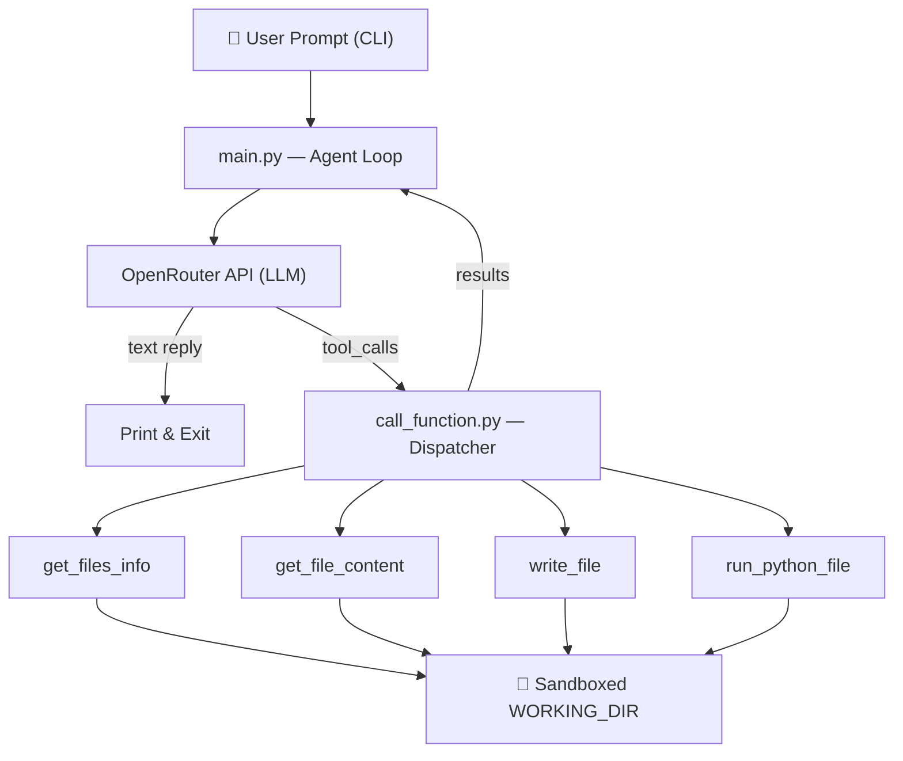

# 🤖 coding-agent

A lightweight, terminal-based AI coding agent that uses LLMs via [OpenRouter](https://openrouter.ai/) to autonomously explore, read, write, and execute Python code within a sandboxed working directory.

> **⚠️ Disclaimer:** This is an experimental/toy project. The system prompt is minimal and only basic guardrails are implemented. Do not use it for production workloads or on untrusted codebases.

## ✨ Features

- **Conversational coding assistant** — describe a task in natural language and let the agent figure out the steps.
- **Function calling (tool use)** — the agent autonomously decides when to list files, read code, write changes, or run scripts.
- **Sandboxed file operations** — all filesystem access is confined to a configurable working directory; path traversal is blocked.
- **Execution with timeout** — Python scripts are executed in a subprocess with a configurable timeout to prevent runaway processes.
- **Iterative reasoning** — the agent can chain multiple tool calls in a loop before producing a final answer, up to a configurable iteration limit.
- **Verbose mode** — optionally see every tool call, its arguments, results, and token usage.

## 🏗️ Architecture



1. The user provides a prompt via the CLI.
2. The prompt (along with a system instruction) is sent to an LLM through OpenRouter.
3. If the model returns **tool calls**, the dispatcher executes them against the sandboxed working directory and feeds results back to the model.
4. Steps 2–3 repeat until the model returns a **text response** or the iteration limit is reached.

## 🚀 Getting Started

### Prerequisites

- **Python 3.14+**
- **[uv](https://docs.astral.sh/uv/)** (recommended) or pip
- An **[OpenRouter](https://openrouter.ai/) API key**

### Installation

```bash
# Clone the repository
git clone https://github.com/<your-username>/coding-agent.git
cd coding-agent

# Create and activate a virtual environment
uv venv
source .venv/bin/activate

# Install dependencies
uv sync
```

### Configuration

Copy the example environment file and add your API key:

```bash
cp .env.example .env
```

Edit `.env`:

```env
OPENROUTER_API_KEY=your_api_key_here
```

You can also customize the agent's behavior through [`config.py`](config.py):

| Variable               | Default          | Description                                         |
|------------------------|------------------|-----------------------------------------------------|
| `MAX_CHARS`            | `10000`          | Max characters to read from a single file           |
| `EXECUTION_TIMEOUT`    | `30`             | Timeout (seconds) for running Python files          |
| `WORKING_DIR`          | `./calculator`   | Sandboxed directory the agent operates within       |
| `MAX_AGENT_ITERATIONS` | `20`             | Max tool-call loops before the agent gives up        |

## 📖 Usage

```bash
# Basic usage
python main.py "List all files in the project"

# With verbose output (shows tool calls, args & token usage)
python main.py --verbose "Read main.py and explain what it does"

# Ask the agent to modify code
python main.py "Add a modulo operation to the calculator"

# Ask the agent to run and test code
python main.py "Run the tests and fix any failures"
```

## 🔧 Available Tools

The agent has access to four tools, each defined in the `functions/` directory:

| Tool | File | Description |
|------|------|-------------|
| `get_files_info` | [`get_files_info.py`](functions/get_files_info.py) | Lists files and subdirectories with size and type info |
| `get_file_content` | [`get_file_content.py`](functions/get_file_content.py) | Reads text file contents (truncated at `MAX_CHARS`) |
| `write_file` | [`write_file.py`](functions/write_file.py) | Creates or overwrites a file (auto-creates parent dirs) |
| `run_python_file` | [`run_python_file.py`](functions/run_python_file.py) | Executes a `.py` file with optional args and captures output |

All tools enforce **path sandboxing** — they resolve paths against `WORKING_DIR` and reject any path that escapes it (e.g., via `..` or absolute paths).

## 🧪 Testing

The project includes manual test scripts for each tool function:

```bash
# Run all tests
python test_get_files_info.py
python test_get_file_content.py
python test_run_python_file.py
python test_write_file.py
```

Tests exercise both happy paths and error cases (path traversal, missing files, non-existent directories, etc.) against the included `calculator/` sample project.

## 📁 Project Structure

```
coding-agent/
├── main.py                  # CLI entry point & agent loop
├── config.py                # Configuration constants
├── prompts.py               # System prompt for the LLM
├── call_function.py         # Tool-call dispatcher
├── functions/               # Tool implementations
│   ├── get_files_info.py    #   List directory contents
│   ├── get_file_content.py  #   Read file contents
│   ├── run_python_file.py   #   Execute Python files
│   └── write_file.py        #   Write/create files
├── calculator/              # Sample project (agent's sandbox target)
│   ├── main.py              #   CLI calculator app
│   ├── pkg/                 #   Calculator & rendering logic
│   ├── tests.py             #   Calculator tests
│   └── ...
├── test_*.py                # Tool function test scripts
├── pyproject.toml           # Project metadata & dependencies
├── .env.example             # Environment variable template
└── .python-version          # Python version (3.14)
```

## 🛡️ Security Considerations

| Mechanism | How It Works |
|-----------|-------------|
| **Path sandboxing** | All tools resolve paths with `os.path.normpath` and validate them using `os.path.commonpath()` against the working directory. Any path that escapes the sandbox (via `..`, symlinks, or absolute paths) is rejected before any I/O occurs. |
| **Server-side directory injection** | The `working_directory` parameter is never exposed to the LLM — it is injected by the dispatcher (`call_function.py`) on every tool call, so the model cannot override it. |
| **No shell execution** | `subprocess.run` is called **without** `shell=True`. Only `.py` files are allowed (extension is validated). This prevents shell injection attacks. *(Shell command support is planned — see [TODO](#-todo).)* |
| **Execution timeout** | Python scripts run with a `30`-second timeout (configurable via `EXECUTION_TIMEOUT`) to prevent infinite loops or runaway processes. |
| **Read truncation** | File reads are capped at `10,000` characters (`MAX_CHARS`). Content beyond the limit is truncated with a notice, preventing excessive memory consumption. |
| **Iteration cap** | The agent loop is hard-limited to `20` iterations (`MAX_AGENT_ITERATIONS`), preventing infinite tool-call chains and unbounded API costs. |

> **⚠️ Note:** This is a toy/experimental project. The sandboxing is **not** hardened for adversarial use — for example, symlink attacks, race conditions, and creative prompt injections are not mitigated. Do not run this on sensitive codebases.

## 📋 TODO

- [ ] Add function to run shell commands
- [ ] Add ability for the user to prompt again (multi-turn conversation)
